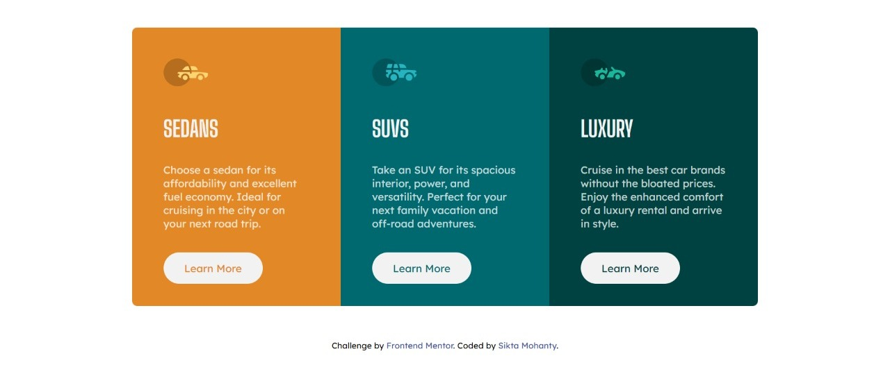

# Frontend Mentor - 3-column preview card component solution

This is a solution to the [3-column preview card component challenge on Frontend Mentor](https://www.frontendmentor.io/challenges/3column-preview-card-component-pH92eAR2-). Frontend Mentor challenges help you improve your coding skills by building realistic projects. 

## Table of contents

- [Overview](#overview)
  - [The challenge](#the-challenge)
  - [Screenshot](#screenshot)
  - [Links](#links)
  - [Built with](#built-with)
- [Author](#author)

## Overview

Challenge is to build out this 3-column preview card component and get it looking as close to the design as possible.

### The challenge

Users should be able to:

- View the optimal layout depending on their device's screen size
- See hover states for interactive elements

### Screenshot

### Links

- Solution URL: [FrontendMentor Solution URL](https://www.frontendmentor.io/solutions/3column-preview-card-component-using-html-and-css-HkX_B7krc)
- Live Site URL: [GitHub Pages](https://sikta2002.github.io/3-column-preview-card-component/)

### Built with

- Semantic HTML5 markup
- CSS custom properties
- Flexbox
- CSS Grid
- Mobile-first workflow

## Author

- Website - [Sikta Mohanty](https://github.com/Sikta2002)
- Frontend Mentor - [@Sikta2002](https://www.frontendmentor.io/profile/Sikta2002)
- Twitter - [@moonsikta](https://twitter.com/moonsikta)
